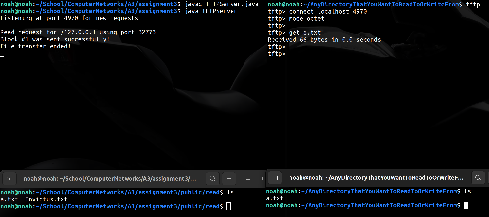
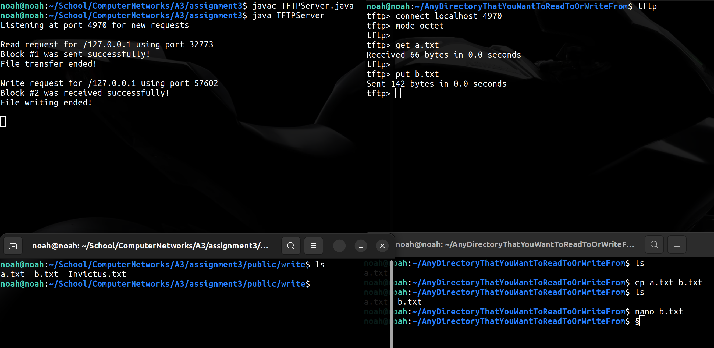

# Assignment 3 - 1DV701

Author: Noah Carlsson (nc222hx) & Yishu Yang (yy222cm)

## Important steps before running the TFTP Server

The default port is hardcoded to 4970.
This can of course be altered.
Make sure to do so before compiling the program.

Read/Write directories are defaulted to Unix (Linux etc.).
Commented out Windows versions exist and can be changed to in case the server is to be run on a Windows machine.

## How to compile and run the TFTP Server

The following commands present a simple way to compile and run the TFTP Server in your favorite CLI.
The server can be run in other ways, with the following being my preference.

To compile the TFTP Server: `javac TFTPServer.java`

Simply run the server with: `java TFTPServer`

## How to read/write

To read from or write to the server, the `get` and `put` commands are utilized.
In the following screenshots I will perform a get and put command to present how the process works as a whole.

Important to note:
When reading from the server, all files that can be read are stored in the `./public/read/` directory.
Writing to the server will store the file in the `./public/write/` directory.
This means that you cannot by default write a file to the server, and then read it instantly since the directories differ.
A written file would have to be moved to the read directory before it can be read.
This can be done in a few different ways.
For example:
The directories could be merged together, or some other type of logic could be added to automatically move written content to the read storage after security checks or alike.

Now to the explanation part:

If TFTP isn't installed on your device by default you would have to start off by installing that.
On some Linux distributions it's installed by default.
If not, download it using apt-get or alike.

Once TFTP is installed we can utilize our favorite CLI to connect to the server.
Make sure the server is running before you attempt to connect.

To start TFTP we simply write: `tftp`

We then connect using `connect localhost <port>`

After that, ensure to specify `octet` as the mode: `mode octet`

Now we are set up to start running `get` and `put` commands.

### Reading - GET

The following picture shows a `get` command being run to retrieve the `a.txt` file.
In the top left we can see the server being compiled and run.
Top right shows how TFTP is run and set up on the computer to perform the `get` command.
Bottom left shows the `./public/read/` directory and it's content.
Lastly, bottom right shows that the file was successfully read and stored in the directory TFTP was run from.

### Writing - PUT

To write a file using the `put` command, the file has to exist within the directory TFTP is run from.
In the bottom right of the following image, `a.txt` is copied as `b.txt`.
The file is then altered by adding some more text to it.
This new example file is now ready to be `put` on the server.
The `put` command is run on the file in the top right of the image.
142 bytes are sent, showing that the file was indeed altered.
In the bottom left we see the result of the writing.
The file now exists on the server within the `./public/write/` directory.

## Relative read/write directories

The read and write directories are relative to the TFTP Server.
Read/Write directories are saved under the public folder in relation to the working directory.
Ensure that you are running the server in the same directory as the public folder is located within.
